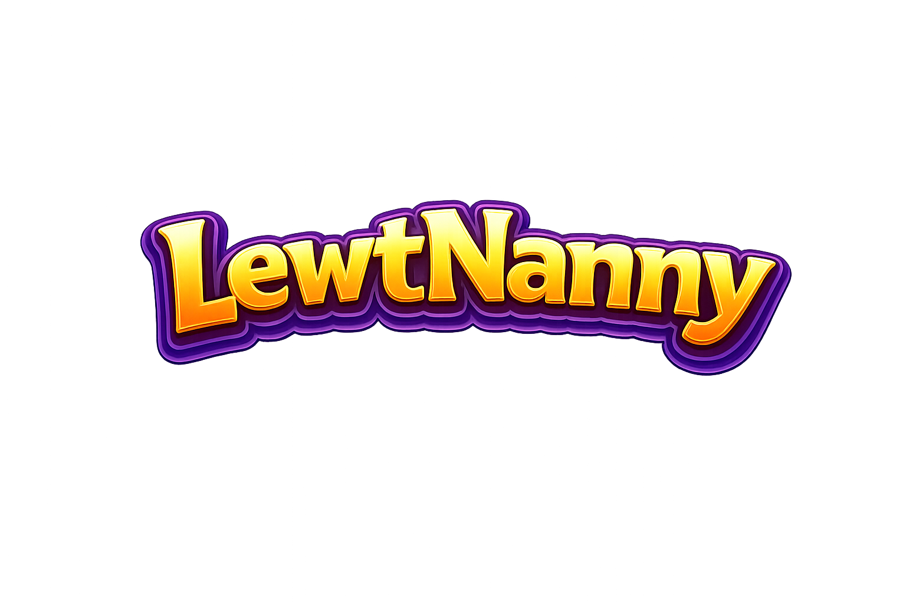

# LewtNanny



A comprehensive loot tracking and financial analytics application for Entropia Universe players.

## Features

- **Real-time Chat Log Monitoring**: Parse game events as they happen
- **Financial Analytics**: Track ROI, costs, and profitability
- **Weapon & Crafting Database**: 14,000+ items with detailed stats
- **Session Management**: Organize tracking by hunting/crafting/mining sessions
- **Data Export**: Analyze your gameplay patterns over time
- **Interactive Dashboard**: Visual charts and statistics
- **Streamer Overlay**: Real-time stats overlay for content creators
- **Theme Support**: Dark and light themes available

## Screenshots

The application features a modern tabbed interface with comprehensive analytics:

- **Dashboard**: Real-time session statistics and financial metrics
- **Combat Tab**: Weapon selection, damage analysis, and combat tracking
- **Crafting Tab**: Blueprint tracking and crafting analytics
- **Analysis Tab**: Historical data and performance charts
- **Settings Tab**: Configuration and data management

## Quick Start

### Prerequisites

- Python 3.8 or higher
- Windows OS (recommended)

### Installation

1. **Download the Latest Release**
   - Get the executable from the [Releases](https://github.com/suttonwilliamd/LewtNanny/releases) page
   - No installation required - just run the executable

2. **Or Build from Source**
   ```bash
   git clone https://github.com/suttonwilliamd/LewtNanny.git
   cd LewtNanny
   pip install -r requirements.txt
   ```

### Running the Application

#### Option 1: Downloaded Executable
Simply run `LewtNanny.exe` from the downloaded archive.

#### Option 2: From Source
```bash
# Full version with all features
python main.py

# MVP version (minimal dependencies)
python main_mvp.py
```

### Configuration

1. Set your Entropia Universe chat log directory
2. Configure your preferred tracking settings
3. Start your first session and begin tracking!

## Project Structure

```
LewtNanny/
├── main.py              # Full application entry point
├── main_mvp.py          # MVP version (no external deps)
├── requirements.txt     # Python dependencies
├── cli.py               # CLI interface
├── cli_commands.py      # CLI commands
├── weapon_selector.py   # Weapon selection UI
├── overlay.py           # In-game overlay
├── weapons.json         # Weapon database (290KB)
├── crafting.json        # Crafting blueprints (920KB)
├── LewtNanny.png        # Application logo
├── src/                 # Source code
│   ├── core/            # Core functionality
│   ├── models/          # Data models
│   ├── services/        # Business logic
│   ├── ui/              # User interface
│   └── utils/           # Utilities
├── config/              # Configuration files
├── data/                # Runtime data storage
├── themes/              # UI themes
├── tools/               # Utility scripts
└── tests/               # Test suite
```

## Key Features in Detail

### Financial Analytics
- Track return on investment (ROI) for hunting, crafting, and mining
- Calculate cost per damage and efficiency metrics
- Monitor profit/loss trends over time

### Weapon Database
- 14,000+ weapons with detailed specifications
- Damage calculations and decay tracking
- Weapon selection and comparison tools

### Session Management
- Create custom hunting, crafting, or mining sessions
- Track individual session performance
- Export data for external analysis

### Real-time Overlay
- Live statistics display during gameplay
- Streamer-friendly overlay with customizable positioning
- Performance metrics at a glance

## Data Tracking

LewtNanny tracks:
- Combat events (damage, critical hits, misses)
- Loot events (items, values, markup)
- Skill gains and progress
- Resource consumption and costs
- Session duration and efficiency

## Running Tests

```bash
# Run all tests
pytest tests/

# Run specific test categories
pytest tests/test_combat.py
pytest tests/test_crafting.py
pytest tests/test_ui.py
```

## Contributing

Contributions are welcome! Please feel free to submit pull requests or create issues for:
- Bug reports
- Feature requests
- Data improvements
- Documentation updates

## Support the Project

If you find LewtNanny helpful and want to support its continued development:

### 💚 Donate via PayPal
[](https://www.paypal.com/donate/?hosted_button_id=C8NM596JX8V8E)

Your donations help cover:
- Development time and maintenance
- Database updates and improvements
- Hosting costs for releases
- Testing and quality assurance

### Other Ways to Support
- ⭐ Star the repository on GitHub
- 🐛 Report bugs and issues
- 💡 Suggest new features
- 📝 Help improve documentation

## Changelog

### Latest Release
- ✅ Added PayPal donation button in the application
- 🎨 Improved UI/UX with modern themes
- 📊 Enhanced analytics and reporting
- 🔧 Fixed various bugs and performance issues

See the full [CHANGELOG.md](CHANGELOG.md) for detailed version history.

## License

MIT License - see LICENSE file for details.

## Credits

Created and maintained by [suttonwilliamd](https://github.com/suttonwilliamd)

Special thanks to the Entropia Universe community for feedback, suggestions, and support!

---

**Disclaimer**: LewtNanny is a third-party tool and is not affiliated with Entropia Universe or MindArk. Use responsibly and in accordance with the game's terms of service.